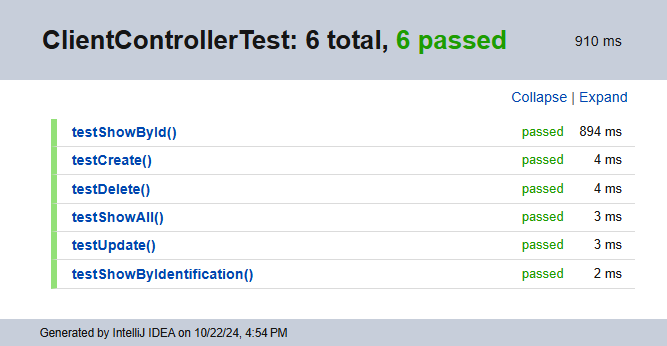

# My Search

_Proyecto simple que permite buscar un cliente por su cedula de identidad. Se puede ver el detalle de cada cliente._

### 🔧 Instalación

_En el directorio del proyecto corre el archivo:_

```
MySearchBackendApplication.java
```

_El tipo de documento y el número de documento de prueba son:_

```
Tipo de documento: Cédula de ciudadanía
Número de documento: 23445322
```

_Para ver la documentación de la API ingresa al enlace:_

```
http://localhost:8090/swagger-ui/index.html
```

_Para ejecutar las pruebas corre el archivo:_

```
MySearchBackendApplicationTest.java
```

## 📦 Resultados

_Puedes ver el frontend en:_

[My Search](https://github.com/Kalevins/my-search)

_Resultados de las pruebas:_



_O en el archivo:_

```
Test Results.html
```

## 🛠️ Construcción

* [Spring Boot](https://spring.io/projects/spring-boot) - Framework de desarrollo
* [Java](https://www.java.com/es/) - Lenguaje de programación
* [Maven](https://maven.apache.org/) - Manejador de dependencias
* [JUnit](https://junit.org/junit5/) - Framework de pruebas
* [Mockito](https://site.mockito.org/) - Framework de pruebas
* [Swagger](https://swagger.io/) - Documentación de API
* [H2](https://www.h2database.com/html/main.html) - Base de datos en memoria
* [Lombok](https://projectlombok.org/) - Anotaciones para reducir código
* [Spring Data JPA](https://spring.io/projects/spring-data-jpa) - Acceso a datos

## ✒️ Autores

* **Kevin Muñoz Rengifo** - *Totalidad* - [Kalevins](https://github.com/Kalevins)

## 🎁 Expresiones de Gratitud

* Agradecimientos especiales a NTT DATA.
